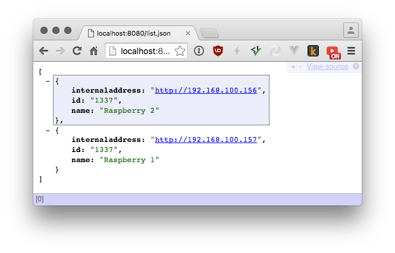

# nupnp

Discovery broker for IoT devices. 🤖



## API
Register device with:
```
curl -H "Content-Type: application/json" -X POST -d '{"id":"41945125","name":"Testdevice","address":"192.168.100.151"}' http://localhost:8180/api/register
```

List device with:
```
http://localhost:8180/api/devices
```

## Register to nupnp.com
Put this script into `/etc/cron.daily`.
```
ip=$(ip -f inet -o addr show eth0|cut -d\  -f 7 | cut -d/ -f 1)
curl -H "Content-Type: application/json" -X POST -d "{\"id\":\"41945125\",\"name\":\"$(hostname)\",\"address\":\"$ip\"}" https://nupnp.com/api/register
```

## Inspiration
>After about 1 minute open a web browser and point to find.z-wave.me. Below the login screen you will see the IP address of your RaZberry system. Click on the IP address link to open the configuration dialog.

* http://www.meethue.com/api/nupnp
* http://find.z-wave.me

## TODO
- [ ] Check and validate query parameters.
- [ ] Add a secret to limit access.
- [ ] Are we going to support devices that register with local host?
- [ ] rate limit requests
- [ ] Create access keys for email address, which are not rate limited
- [ ] let user create custom namespaces (paired with access keys)
- [ ] Do I need to use an in memory database?
- [ ] Tests
- [ ] sanitize input
- [ ] sort devices by date added
- [ ] return success message "device added, visit https://nupnp.com"
- [ ] if id is missing, generate uuid
- [ ] Add support for port parameter

## Security
Never allow another IP address to access the data. Remove the entries after 24h.

## Notes
Users should not use this service directly, they should not bookmark it. But they will...
Users should only use it to discover their device and then bookmark it.

The device should not publish his IP address all the time, best would be only after a startup or after user requests it.

## License
[MIT](https://tldrlegal.com/license/mit-license)
